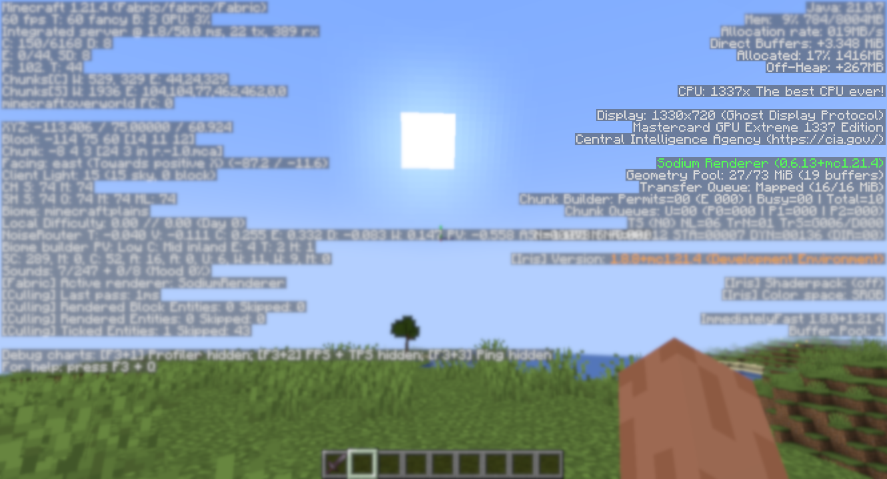

  <!-- Introduction -->
  <h1>Incognito</h1>
  Anonymize Minecraft by spoofing computer hardware specifications.
   
  Useful for screensharing, recording or streaming. 
    

  <!-- Badges & icons -->

 
  <!-- Quick navigation -->
[Releases](https://github.com/jonesdevelopment/incognito/releases)
|
[Issues](https://github.com/jonesdevelopment/incognito/issues)
|
[Pull Requests](https://github.com/jonesdevelopment/incognito/pulls)
|
[Discord](https://jonesdev.xyz/discord)
|
[License](https://github.com/jonesdevelopment/incognito/?tab=readme-ov-file#license)

## Goal
* Ability to customize CPU information (name, model, vendor, logical/physical core count, etc.)
* Ability to customize GPU information (model, vendor, driver version, etc.)

Since Incognito changes spoofs how the CPU/GPU is detected, this will work with other mods, e.g., BetterF3.

*Note: This mod requires both [Cloth Config API](<https://modrinth.com/mod/cloth-config>) and [Mod Menu](<https://modrinth.com/mod/modmenu>) to be installed.*

## Why?

Privacy and anonymity! It's as simple as that.
Incognito prevents a single screenshot, clip, live stream, or video from exposing your real computer hardware specifications.
This hardware information is commonly used for [fingerprinting](<https://en.wikipedia.org/wiki/Device_fingerprint>).
If you value your digital privacy and don't want people tracking you based on your computer hardware, consider giving it a try.
Even if you don't care about the privacy aspect(s), it's still a fun tool to play around with.

## License
Incognito is licensed under the [GNU General Public License 3.0](https://www.gnu.org/licenses/gpl-3.0.en.html).

## Credits
- Special thanks to the [contributors of Incognito](https://github.com/jonesdevelopment/incognito/graphs/contributors).
- The codebase is [fabric-example-mod](<https://github.com/FabricMC/fabric-example-mod>).

*Note: This mod is a proof of concept.*
